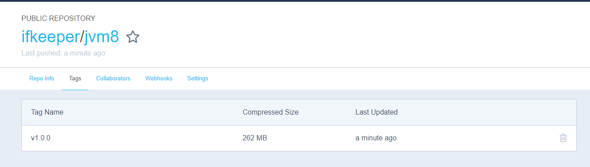

# 基于 Centos 构建 JVM8 环境

---

在前面已经详细介绍了 Dockerfile 文件指令与用法。本节就通过前文介绍的指令基于 centos 基础镜像构建 jvm8 环境。

## 查找 Centos 基础镜像

在笔者是基于 centos 基础镜像构建 jvm8 环境。所以在构建镜像之前先在镜像库中查找 centos 镜像及版本信息。执行如下命令：

```
docker search centos
```

命令示例：

```
[root@localhost /]# docker search centos
NAME                               DESCRIPTION                                     STARS               OFFICIAL            AUTOMATED
centos                             The official build of CentOS.                   5032                [OK]                
ansible/centos7-ansible            Ansible on Centos7                              119                                     [OK]
jdeathe/centos-ssh                 CentOS-6 6.10 x86_64 / CentOS-7 7.5.1804 x86…   102                                     [OK]
consol/centos-xfce-vnc             Centos container with "headless" VNC session…   73                                      [OK]
imagine10255/centos6-lnmp-php56    centos6-lnmp-php56                              48                                      [OK]
centos/mysql-57-centos7            MySQL 5.7 SQL database server                   43                                      
tutum/centos                       Simple CentOS docker image with SSH access      43                                      
gluster/gluster-centos             Official GlusterFS Image [ CentOS-7 +  Glust…   37                                      [OK]
openshift/base-centos7             A Centos7 derived base image for Source-To-I…   36                                      
centos/postgresql-96-centos7       PostgreSQL is an advanced Object-Relational …   35                                      
centos/python-35-centos7           Platform for building and running Python 3.5…   32                                      
kinogmt/centos-ssh                 CentOS with SSH                                 25                                      [OK]
openshift/jenkins-2-centos7        A Centos7 based Jenkins v2.x image for use w…   18                                      
centos/php-56-centos7              Platform for building and running PHP 5.6 ap…   17                                      
pivotaldata/centos-gpdb-dev        CentOS image for GPDB development. Tag names…   8                                       
openshift/wildfly-101-centos7      A Centos7 based WildFly v10.1 image for use …   6                                       
openshift/jenkins-1-centos7        DEPRECATED: A Centos7 based Jenkins v1.x ima…   4                                       
darksheer/centos                   Base Centos Image -- Updated hourly             3                                       [OK]
pivotaldata/centos                 Base centos, freshened up a little with a Do…   2                                       
pivotaldata/centos-mingw           Using the mingw toolchain to cross-compile t…   2                                       
pivotaldata/centos-gcc-toolchain   CentOS with a toolchain, but unaffiliated wi…   1                                       
blacklabelops/centos               CentOS Base Image! Built and Updates Daily!     1                                       [OK]
pivotaldata/centos7-test           CentosOS 7 image for GPDB testing               0                                       
smartentry/centos                  centos with smartentry                          0                                       [OK]
pivotaldata/centos7-build          CentosOS 7 image for GPDB compilation           0        
```

可以看到名称为 `centos` 的镜像是官方镜像，并别 `star` 高达 5k，就使用这个镜像作为基础镜像。

**注意：** 在 `centos` 镜像前没有组织名称，原因是默认为官方镜像 `docker/centos`。因此省略不显示。

## 上传 JVM

现在进行创建一个 `centos-jvm8` 文件夹：

```
[root@localhost v1]# mkdir centos-jvm8
[root@localhost v1]# cd centos-jvm8/
[root@localhost centos-jvm8]# ls
[root@localhost centos-jvm8]# 
```

并将在 [Oracle 官网](https://www.oracle.com) 下载的 linux 版本 jvm8 上传至该文件夹：

```
[root@localhost centos-jvm8]# rz

[root@localhost centos-jvm8]# ls
jdk-8u181-linux-x64.tar.gz
```

**注意：**该文件不需要进行解压，还记得在 [Dockerfile 详解](./Dockerfile.md) 章节结束的 `ADD` 指令吗？该指令会自动解压 `tar` 文件为目录！

## 编写 Dockerfile

在该文件夹下继续创建文件 `Dockerfile`：

```
[root@localhost centos-jvm8]# touch Dockerfile
[root@localhost centos-jvm8]# ls
Dockerfile jdk-8u181-linux-x64.tar.gz
```

创建完成之后进行 `vim` 编辑，内容如下所示：

```
#This Dockerfile use centos image
# Version 1 - EDITION 1
# Author: MinGRn

# Base Image
FROM centos

# Maintainer: MinGRn <MinGRn97@gmail.com>
MAINTAINER MinGRn MinGRn97@gmail.com

# Add JVM To Base Image
ADD jdk-8u181-linux-x64.tar.gz /opt/jvm

# JVM Environment
ENV JAVA_HOME /opt/jvm/jdk1.8.0_181
ENV CLASSPATH $JAVA_HOME/lib/dt.jar:$JAVA_HOME/lib/tools.jar
ENV PATH $PATH:$JAVA_HOME/bin

ENTRYPOINT ["java", "-version"]
```

<!--sec data-title="注意" data-id="section0" data-show=true ces-->
`FROM` 指令后直接跟 `centos` 并没有写版本后会默认选择 `centos lastest` 版本作为基础镜像。

`ADD jdk-8u181-linux-x64.tar.gz /opt/jvm` 指令是将 `jdk-8u181-linux-x64.tar.gz` 文件添加进入基础镜像的 `/opt/jvm` 目录，如果没有该目录会进行创建。其中压缩包是 Dockerfile 的相对路径。一般在创建时为了防止路径出错都会将目标文件放置 Dockerfile 的同一目录。

```
ENV JAVA_HOME /opt/jvm/jdk1.8.0_181
ENV CLASSPATH $JAVA_HOME/lib/dt.jar:$JAVA_HOME/lib/tools.jar
ENV PATH $PATH:$JAVA_HOME/bin
```

这三个指令时配置基于基础镜像配置 JVM 环境变量。

`ENV JAVA_HOME /opt/jvm/jdk1.8.0_181` 这里直接写 `jdk1.8.0_181` 的原因是 `jdk-8u181-linux-x64.tar.gz` 压缩包解压后的目录就是该目录。不行？你可以试试。

`ENTRYPOINT ["java", "-version"]` 指令是创建容器后的启动命令打印 jvm 版本信息。当然，也可以直接使用 `CMD` 指令，关于 `CMD` 与 `Entrypoint` 指令的区别见： [**RUN & CMD & Entrypoint**](./run-cmd-entrypoint.md)
<!--endsec-->

现在就可以执行指令进行构建镜像了。

## 构建镜像

构建镜像指令是 `docker build` 具体如下：

```
[root@localhost v1]# docker build --help

Usage:  docker build [OPTIONS] PATH | URL | -

Build an image from a Dockerfile

Options:
      --add-host list           Add a custom host-to-IP mapping (host:ip)
      --build-arg list          Set build-time variables
      --cache-from strings      Images to consider as cache sources
      --cgroup-parent string    Optional parent cgroup for the container
      --compress                Compress the build context using gzip
      --cpu-period int          Limit the CPU CFS (Completely Fair Scheduler) period
      --cpu-quota int           Limit the CPU CFS (Completely Fair Scheduler) quota
  -c, --cpu-shares int          CPU shares (relative weight)
      --cpuset-cpus string      CPUs in which to allow execution (0-3, 0,1)
      --cpuset-mems string      MEMs in which to allow execution (0-3, 0,1)
      --disable-content-trust   Skip image verification (default true)
  -f, --file string             Name of the Dockerfile (Default is 'PATH/Dockerfile')
      --force-rm                Always remove intermediate containers
      --iidfile string          Write the image ID to the file
      --isolation string        Container isolation technology
      --label list              Set metadata for an image
  -m, --memory bytes            Memory limit
      --memory-swap bytes       Swap limit equal to memory plus swap: '-1' to enable unlimited swap
      --network string          Set the networking mode for the RUN instructions during build (default "default")
      --no-cache                Do not use cache when building the image
      --pull                    Always attempt to pull a newer version of the image
  -q, --quiet                   Suppress the build output and print image ID on success
      --rm                      Remove intermediate containers after a successful build (default true)
      --security-opt strings    Security options
      --shm-size bytes          Size of /dev/shm
  -t, --tag list                Name and optionally a tag in the 'name:tag' format
      --target string           Set the target build stage to build.
      --ulimit ulimit           Ulimit options (default [])
```

其中 `-t` 选项是将镜像打标签。在构建镜像时一定要增加该标签，不然会默认该版本镜像为 `lastest`。

现在在当前目录执行构建标签指令：

```
docker build -t jvm8:v1.0.0 ./
```

命令执行示例：

```
[root@localhost v1]# docker build -t jvm8:v1.0.0 ./
Sending build context to Docker daemon  185.7MB
Step 1/7 : FROM centos
 ---> 1e1148e4cc2c
Step 2/7 : MAINTAINER MinGRn MinGRn97@gmail.com
 ---> Running in 4be5b85528a7
Removing intermediate container 4be5b85528a7
 ---> ad64fb563756
Step 3/7 : ADD jdk-8u181-linux-x64.tar.gz /opt/jvm
 ---> d939416fd6a0
Step 4/7 : ENV JAVA_HOME /opt/jvm/jdk1.8.0_181
 ---> Running in 11d8ce8b6914
Removing intermediate container 11d8ce8b6914
 ---> e736522a5ccd
Step 5/7 : ENV CLASSPATH $JAVA_HOME/lib/dt.jar:$JAVA_HOME/lib/tools.jar
 ---> Running in 351929607b74
Removing intermediate container 351929607b74
 ---> 192b28b23407
Step 6/7 : ENV PATH $PATH:$JAVA_HOME/bin
 ---> Running in 28875d5a1ae7
Removing intermediate container 28875d5a1ae7
 ---> 30786547f925
Step 7/7 : ENTRYPOINT ["java", "-version"]
 ---> Running in 87c0fe35c366
Removing intermediate container 87c0fe35c366
 ---> 9ef7f38f2bf1
Successfully built 9ef7f38f2bf1
Successfully tagged jvm8:v1.0.0
```

可以看到已经提示构建成功，并且 tag 是 `v1.0.0`。现在执行命令查看是否存在该镜像：

```
[root@localhost v1]# docker images
REPOSITORY             TAG                 IMAGE ID            CREATED             SIZE
jvm8                   v1.0.0              9ef7f38f2bf1        29 seconds ago      583MB
ifkeeper/centos-jvm8   v1.0.0              e15334134272        18 hours ago        583MB
centos                 latest              1e1148e4cc2c        3 days ago          202MB
openjdk                latest              8e7eacedab93        4 days ago          986MB
```

可以看到大小为 583M。

现在将该运行该经常成为一个容器，看是否打印 JVM Version 信息：

```
docker run 9ef7f38f2bf1
或者
docker run jvm8:v1.0.0
```

命令执行示例：

```
[root@localhost v1]# docker run 9ef7f38f2bf1
java version "1.8.0_181"
Java(TM) SE Runtime Environment (build 1.8.0_181-b13)
Java HotSpot(TM) 64-Bit Server VM (build 25.181-b13, mixed mode)
```

成功打印 JVM Version 信息，说明镜像构建没有问题！

现在来看下如何将镜像上传至镜像仓库。

## 上传镜像至仓库

打开 [Docker Hub](https://hub.docker.com) 然后登录自己的账号。


然后创建仓库，仓库名为 `jvm8`：


这里仓库的组织为 `ifkeeper`。现在回到命令，将构建的 `jvm8` 镜像进行打标签，打标签命令：

```
[root@localhost centos-jvm8]# docker tag --help

Usage:  docker tag SOURCE_IMAGE[:TAG] TARGET_IMAGE[:TAG]

Create a tag TARGET_IMAGE that refers to SOURCE_IMAGE
```

命令示例：

```
[root@localhost centos-jvm8]# docker tag jvm8:v1.0.0 ifkeeper/jvm8:v1.0.0
[root@localhost centos-jvm8]# docker images
REPOSITORY             TAG                 IMAGE ID            CREATED             SIZE
ifkeeper/jvm8          v1.0.0              9ef7f38f2bf1        18 minutes ago      583MB
jvm8                   v1.0.0              9ef7f38f2bf1        18 minutes ago      583MB
```

可以看到，`jvm8` 成功被打成标签。

**注意：** 在打标签时要将组织名称加上。比如：笔者想将该镜像推送至 `ifkeeper` 组织，镜像名称为 `jvm8`，版本号为 `v1.0.0`。所以笔者的目标标签为 `ifkeeper/jvm8:v1.0.0`。

现在，进行登录 Docker Hub，登录命令如下：

```
[root@localhost centos-jvm8]# docker login --help

Usage:  docker login [OPTIONS] [SERVER]

Log in to a Docker registry

Options:
  -p, --password string   Password
      --password-stdin    Take the password from stdin
  -u, --username string   Username
```

笔者由于之前已经登陆过，这里直接输入命令 `docker login` 即可登录，如下：

```
[root@localhost centos-jvm8]# docker login
Authenticating with existing credentials...
WARNING! Your password will be stored unencrypted in /root/.docker/config.json.
Configure a credential helper to remove this warning. See
https://docs.docker.com/engine/reference/commandline/login/#credentials-store

Login Succeeded
```

现在登录成功，就将镜像推送至仓库。推送命令：

```
[root@localhost centos-jvm8]# docker push --help

Usage:  docker push [OPTIONS] NAME[:TAG]

Push an image or a repository to a registry

Options:
      --disable-content-trust   Skip image signing (default true)
```

命令执行示例：

```
[root@localhost centos-jvm8]# docker push ifkeeper/jvm8:v1.0.0
The push refers to repository [docker.io/ifkeeper/jvm8]
2c218a57b7e7: Pushed 
071d8bd76517: Mounted from ifkeeper/centos-jvm8 
v1.0.0: digest: sha256:dc3c695f49433ddbc8b821bd5b0019b370ff56d338f8885c6b336780fcb491bb size: 742
```

现在登录 Docker Hub 看是否成功推送：



镜像以成功推送至仓库！

## 查看镜像信息

现在可以通过 `docker inspect` 命令查看镜像构建信息，该命令信息如下：

```
[root@localhost centos-jvm8]# docker inspect --help

Usage:  docker inspect [OPTIONS] NAME|ID [NAME|ID...]

Return low-level information on Docker objects

Options:
  -f, --format string   Format the output using the given Go template
  -s, --size            Display total file sizes if the type is container
      --type string     Return JSON for specified type
```

命令执行示例：

```
[root@localhost centos-jvm8]# docker inspect 9ef7f38f2bf1
[
    {
        "Id": "sha256:9ef7f38f2bf11b5741b92eb48f3fa8f6a1bdc1a4a4d7102e2e601f6f2f440461",
        "RepoTags": [
            "ifkeeper/jvm8:v1.0.0",
            "jvm8:v1.0.0"
        ],
        "RepoDigests": [
            "ifkeeper/jvm8@sha256:dc3c695f49433ddbc8b821bd5b0019b370ff56d338f8885c6b336780fcb491bb"
        ],
        "Parent": "sha256:30786547f925fa91c37bd5980dcb0c184641dd96626fed60a641f93e253630b4",
        "Comment": "",
        "Created": "2018-12-09T07:25:22.002921457Z",
        "Container": "87c0fe35c36672bace745ce01e3e7588913bcbbfab3708c8817dc8123f191815",
        "ContainerConfig": {
            "Hostname": "87c0fe35c366",
            "Domainname": "",
            "User": "",
            "AttachStdin": false,
            "AttachStdout": false,
            "AttachStderr": false,
            "Tty": false,
            "OpenStdin": false,
            "StdinOnce": false,
            "Env": [
                "PATH=/usr/local/sbin:/usr/local/bin:/usr/sbin:/usr/bin:/sbin:/bin:/opt/jvm/jdk1.8.0_181/bin",
                "JAVA_HOME=/opt/jvm/jdk1.8.0_181",
                "CLASSPATH=/opt/jvm/jdk1.8.0_181/lib/dt.jar:/opt/jvm/jdk1.8.0_181/lib/tools.jar"
            ],
            "Cmd": [
                "/bin/sh",
                "-c",
                "#(nop) ",
                "ENTRYPOINT [\"java\" \"-version\"]"
            ],
            "ArgsEscaped": true,
            "Image": "sha256:30786547f925fa91c37bd5980dcb0c184641dd96626fed60a641f93e253630b4",
            "Volumes": null,
            "WorkingDir": "",
            "Entrypoint": [
                "java",
                "-version"
            ],
            "OnBuild": null,
            "Labels": {
                "org.label-schema.build-date": "20181205",
                "org.label-schema.license": "GPLv2",
                "org.label-schema.name": "CentOS Base Image",
                "org.label-schema.schema-version": "1.0",
                "org.label-schema.vendor": "CentOS"
            }
        },
        "DockerVersion": "18.09.0",
        "Author": "MinGRn MinGRn97@gmail.com",
        "Config": {
            "Hostname": "",
            "Domainname": "",
            "User": "",
            "AttachStdin": false,
            "AttachStdout": false,
            "AttachStderr": false,
            "Tty": false,
            "OpenStdin": false,
            "StdinOnce": false,
            "Env": [
                "PATH=/usr/local/sbin:/usr/local/bin:/usr/sbin:/usr/bin:/sbin:/bin:/opt/jvm/jdk1.8.0_181/bin",
                "JAVA_HOME=/opt/jvm/jdk1.8.0_181",
                "CLASSPATH=/opt/jvm/jdk1.8.0_181/lib/dt.jar:/opt/jvm/jdk1.8.0_181/lib/tools.jar"
            ],
            "Cmd": null,
            "ArgsEscaped": true,
            "Image": "sha256:30786547f925fa91c37bd5980dcb0c184641dd96626fed60a641f93e253630b4",
            "Volumes": null,
            "WorkingDir": "",
            "Entrypoint": [
                "java",
                "-version"
            ],
            "OnBuild": null,
            "Labels": {
                "org.label-schema.build-date": "20181205",
                "org.label-schema.license": "GPLv2",
                "org.label-schema.name": "CentOS Base Image",
                "org.label-schema.schema-version": "1.0",
                "org.label-schema.vendor": "CentOS"
            }
        },
        "Architecture": "amd64",
        "Os": "linux",
        "Size": 583469631,
        "VirtualSize": 583469631,
        "GraphDriver": {
            "Data": {
                "LowerDir": "/var/lib/docker/overlay2/f0a77ed5662eaa4757e8765055cebdc5fb33f297ed9b5cecb46efaa494e5ca75/diff",
                "MergedDir": "/var/lib/docker/overlay2/a3a109cea18169342f1d6281881fc149b78511216d418b6fa5e507dfbcb54e30/merged",
                "UpperDir": "/var/lib/docker/overlay2/a3a109cea18169342f1d6281881fc149b78511216d418b6fa5e507dfbcb54e30/diff",
                "WorkDir": "/var/lib/docker/overlay2/a3a109cea18169342f1d6281881fc149b78511216d418b6fa5e507dfbcb54e30/work"
            },
            "Name": "overlay2"
        },
        "RootFS": {
            "Type": "layers",
            "Layers": [
                "sha256:071d8bd765171080d01682844524be57ac9883e53079b6ac66707e192ea25956",
                "sha256:2c218a57b7e7b5504cbfb63802743e718c43f7a34f46ef91d8b95b7ffb69dd46"
            ]
        },
        "Metadata": {
            "LastTagTime": "2018-12-09T15:43:21.810359161+08:00"
        }
    }
]
```

在镜像信息中可以看到 镜像id、镜像仓库与标签、镜像作者、镜像命令信息。这些信息很重要，比如追溯源镜像信息。具体后面作讲解。