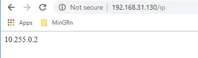

# 要求

在构建服务之前需要满足一下条件：

- 安装 Docker Compose，具体见 [三剑客之 Compose 安装篇]()
- 知道什么是镜像、什么是容器、知道怎么创建镜像
- 在本地或者 Docker Hub 已有可用镜像

# 什么是服务

在分布式应用程序中，应用程序的不同部分称为 **服务**。以某宝来说，它可能包括用于在数据库中存储应用程序数据的服务、用户下单的服务、用户评论服务等等。

当然，你也可以将一个系统中的不同功能称为一一服务。近些年，微服务可以说是红了半边天，未来可能会更加辉煌。微服务的思想就是：一个功能一个服务！

在 Docker 中，服务其实就是生产环境中运行的容器。服务只运行一个镜像（`docker run <images_id>`，其实是容器），但是它对镜像的运行方式进行了
编码 —— 如应该使用什么端口，应该运行容器的多少个副本，以便服务具有所需的容量，等等。

在 Docker 中，使用 Docker 平台定义、运行和扩展服务非常容易 —— 只需编写一个 `docker-compose.yml` 文件。

# 编写 docker-compose

`docker-compose` 文件是一个 `YAML` 文件，用于定于 Docker 容器在生产中的行为方式。现在就来编写一个 `docker-compose.yml` 文件.

```
$ touch docker-compose.yml
$ vim dockercompopse.yml
```

文件内容如下所示：

```yaml
version: "3"
services:
  api:
    image: ifkeeper/web-test:v1.0.2
    deploy:
      replicas: 5
      resources:
        limits:
          cpus: "0.1"
          memory: 1G
      restart_policy:
        condition: on-failure
    ports:
      - "80:80"
    networks:
      - webnet
networks:
  webnet:
```

在定义的 `YMAL` 文件中告诉 Docker 做如下事情：

- 拉取 `ifkeeper/web-test:v1.0.2` 镜像。如果本地没有就去 `Docker Hub` 拉取。
- 定义名称为 `api` 的服务运行该镜像的5个实例。并且限制每个实例最多只能使用 `10%` 的CPU(跨所有核心)和 `1024MB` RAM。
- 将主机上的端口 `80` 映射到 `api` 的端口 `80`。
- 指示 `api` 容器通过称为 `webnet` 的负载平衡网络共享端口 `80`。(在内部，容器本身在一个临时端口发布到 `api` 的 `80` 端口。)
- 使用默认设置定义 `webnet` 网络(这是一个负载均衡的覆盖网络)。

**注意：** `api` 这个名称时随意定义的，当然，你也可以改名为 `web`。

# 使用负载均衡

在运行程序之前需要执行如下命令：

```
$ docker swarm init
```

该命令表示创建 `swarm` 集群，并且该机器为管理节点。如果不运行该命令你会看到如下错误：

```
this node is not a swarm manager. Use "docker swarm init" or "docker swarm join" to connect this node to swarm and try again.
```

关于 `swarm` 这里不做说明，这是 [传送门](./Swarms.md)。

命令执行示例：

```
[root@localhost yml]# docker swarm init
Swarm initialized: current node (09qeks0mgpovbzej6zt0d3kcs) is now a manager.

To add a worker to this swarm, run the following command:

    docker swarm join --token SWMTKN-1-62fcgmhy0m846c3iv4yudkssrg5bez0mpgehndsgk4c7wmt4fo-3o3i1r6f4ebenzdijocdydyx3 192.168.31.130:2377

To add a manager to this swarm, run 'docker swarm join-token manager' and follow the instructions.
```

# 运行服务

成功创建一个 `swarm` 集群之后就可以运行服务了，可以使用如下命令。这里将服务名称定义为 `web`：

```
$ docker stack deploy -c docker-compose.yml test
```

命令示例如下所示：

```
[root@localhost yml]# docker stack deploy -c docker-compose.yml test
Creating network test_webnet
Creating service test_api
```

现在我们的单个服务堆栈在一台主机上运行部署镜像的5个容器实例，可以使用如下命令查看服务：

```
$ docker service ls
```

命令执行示例：

```
[root@localhost yml]# docker service ls
ID                  NAME                MODE                REPLICAS            IMAGE                      PORTS
yt8tpaswma2g        test_api            replicated          5/5                 ifkeeper/web-test:v1.0.2   *:80->80/tcp
```

其中最主要的信息是 `NAME` 和 `REPLICAS`。笔者在 `YAML` 中定义的服务名称为 `api`，在部署的时候命名为 `test`。所以服务名称就是 `test_api`。

如果在 `YAML` 中定义的名称为 `web` 那么服务名称就会使 `test_web`。另外，`REPLICAS` 告诉你创建了5个实例，并且存活数也是5个。

在运行中的服务单个容器称为 **任务**。任务被赋予惟一的 `id`，这些 `id` 在数字上递增，直到您在 `docker-compose.yml` 中定义的副本数量。
可以使用如下命令列出你的服务任务:

```
$ docker service ps <service_name>
```

命令执行示例：

```
[root@localhost yml]# docker service ps test_api
ID                  NAME                IMAGE                      NODE                    DESIRED STATE       CURRENT STATE           ERROR               PORTS
u7tpn66fd438        test_api.1          ifkeeper/web-test:v1.0.2   localhost.localdomain   Running             Running 8 minutes ago                       
018vw5umo31i        test_api.2          ifkeeper/web-test:v1.0.2   localhost.localdomain   Running             Running 8 minutes ago                       
64t7w3qbc82u        test_api.3          ifkeeper/web-test:v1.0.2   localhost.localdomain   Running             Running 8 minutes ago                       
iefpk06kmdqe        test_api.4          ifkeeper/web-test:v1.0.2   localhost.localdomain   Running             Running 8 minutes ago                       
ac7csdun2g1n        test_api.5          ifkeeper/web-test:v1.0.2   localhost.localdomain   Running             Running 8 minutes ago
```

你也可以查看当前机器上运行的容器数量：

```
[root@localhost yml]# docker ps
CONTAINER ID        IMAGE                      COMMAND                  CREATED             STATUS              PORTS               NAMES
ccbd37855cee        ifkeeper/web-test:v1.0.2   "java -jar /app/dock…"   10 minutes ago      Up 9 minutes        80/tcp              test_api.4.iefpk06kmdqe69809q2g7lej8
a7081ab0babf        ifkeeper/web-test:v1.0.2   "java -jar /app/dock…"   10 minutes ago      Up 9 minutes        80/tcp              test_api.5.ac7csdun2g1nz7qy8t1l3ligd
a0a0f01d0586        ifkeeper/web-test:v1.0.2   "java -jar /app/dock…"   10 minutes ago      Up 9 minutes        80/tcp              test_api.2.018vw5umo31irdj7nc097nncx
b7a856f0f63c        ifkeeper/web-test:v1.0.2   "java -jar /app/dock…"   10 minutes ago      Up 10 minutes       80/tcp              test_api.1.u7tpn66fd4380zb4zujif36m5
fe401c039852        ifkeeper/web-test:v1.0.2   "java -jar /app/dock…"   10 minutes ago      Up 10 minutes       80/tcp              test_api.3.64t7w3qbc82u1x56yx7s5szi9
```

现在再访问 `192.168.31.130/ip` 依然成功返回客户端 ip：



<!--sec data-title="注意" data-id="section0" data-show=true ces-->
如果在请求时响应很慢，或者直接提示如下错误。并不是 Docker 或 swarm 性能的指示，而是未满足的Redis依赖。目前，访客计数器的工作原理与此不同，我们还没有添加一个服务来持久化数据。

```
Unable to round-trip http request to upstream: dial tcp 192.168.31.130:80: connectex: No connection could be made because the target machine actively refused it.
```
<!--endsec-->

# 无缝升级与规模扩充

到现在，服务部署已经完成。当然如果服务运行一端时间之后出了问题或者线上节点无法支撑海量访问该怎么办呢？要杀死进程重新部署？使用 Docker 后完全不用。
下面就来说下如何做到无缝升级与规模扩充（或重新部署）。

<!--sec data-title="无缝升级" data-id="section1" data-show=true ces-->

比如，现在开发出来了新版本，旧版本存在一定的bug。笔者想用新的版本支撑线上，将版本从 `v1.0.2` 升到 `v1.0.3`，修改内容如下：

```yaml
version: "3"
services:
  api:
    image: ifkeeper/web-test:v1.0.3
    deploy:
      replicas: 5
      resources:
        limits:
          cpus: "0.1"
          memory: 1G
      restart_policy:
        condition: on-failure
    ports:
      - "80:80"
    networks:
      - webnet
networks:
  webnet:
```

可以看到，仅仅修改了镜像的版本。现在再执行如下命令即可无缝升级。

```
$ docker stack deploy -c test
```

命令执行示例：

```
[root@localhost yml]# docker stack deploy -c docker-compose.yml test
Updating service test_api (id: yt8tpaswma2gors55xd4ioalz)
```

可以看到提示进行修改了服务。现在再执行如下命令查看服务任务：

```
$ docker service ps test_api
```

命令执行示例：

```
[root@localhost yml]# docker service ps test_api
ID                  NAME                IMAGE                      NODE                    DESIRED STATE       CURRENT STATE             ERROR               PORTS
0g6zabvew57l        test_api.1          ifkeeper/web-test:v1.0.3   localhost.localdomain   Running             Running 31 seconds ago                        
u7tpn66fd438         \_ test_api.1      ifkeeper/web-test:v1.0.2   localhost.localdomain   Shutdown            Shutdown 33 seconds ago                       
2s1s05v4xh1v        test_api.2          ifkeeper/web-test:v1.0.3   localhost.localdomain   Running             Running 26 seconds ago                        
018vw5umo31i         \_ test_api.2      ifkeeper/web-test:v1.0.2   localhost.localdomain   Shutdown            Shutdown 27 seconds ago                       
mrv7vnsazem3        test_api.3          ifkeeper/web-test:v1.0.3   localhost.localdomain   Running             Running 48 seconds ago                        
64t7w3qbc82u         \_ test_api.3      ifkeeper/web-test:v1.0.2   localhost.localdomain   Shutdown            Shutdown 49 seconds ago                       
1ftlzhpve41z        test_api.4          ifkeeper/web-test:v1.0.3   localhost.localdomain   Running             Running 37 seconds ago                        
iefpk06kmdqe         \_ test_api.4      ifkeeper/web-test:v1.0.2   localhost.localdomain   Shutdown            Shutdown 38 seconds ago                       
u6s3k4gulrsz        test_api.5          ifkeeper/web-test:v1.0.3   localhost.localdomain   Running             Running 42 seconds ago                        
ac7csdun2g1n         \_ test_api.5      ifkeeper/web-test:v1.0.2   localhost.localdomain   Shutdown            Shutdown 44 seconds ago
```

通过这可以看到，服务重 `v1.0.2` 成功升级到 `v1.0.3`，并且将历史版本也列出来了（这里不能说版本，应该说容器或任务）。

现在就完全已经做到了无缝升级。

<!--endsec-->

<!--sec data-title="规模扩充" data-id="section2" data-show=true ces-->

如果在服务过程中发现 5 个服务实例远远无法支撑线上怎么办？那就可以通过修改节点来进行修改服务节点规模。
这里就不将内容全部列出来，只修改 `replicas` 即可，这里由5个实例扩展到10个：

```yaml
services:
  api:
    image: ifkeeper/web-test:v1.0.3
    deploy:
      replicas: 10
```

现在再执行 `docker stack deploy -c docker-compose.yml <name>` 命令。

```
[root@localhost yml]# docker service ps test_api
ID                  NAME                IMAGE                      NODE                    DESIRED STATE       CURRENT STATE             ERROR               PORTS
0g6zabvew57l        test_api.1          ifkeeper/web-test:v1.0.3   localhost.localdomain   Running             Running 21 minutes ago                        
u7tpn66fd438         \_ test_api.1      ifkeeper/web-test:v1.0.2   localhost.localdomain   Shutdown            Shutdown 21 minutes ago                       
2s1s05v4xh1v        test_api.2          ifkeeper/web-test:v1.0.3   localhost.localdomain   Running             Running 21 minutes ago                        
018vw5umo31i         \_ test_api.2      ifkeeper/web-test:v1.0.2   localhost.localdomain   Shutdown            Shutdown 21 minutes ago                       
mrv7vnsazem3        test_api.3          ifkeeper/web-test:v1.0.3   localhost.localdomain   Running             Running 21 minutes ago                        
64t7w3qbc82u         \_ test_api.3      ifkeeper/web-test:v1.0.2   localhost.localdomain   Shutdown            Shutdown 21 minutes ago                       
1ftlzhpve41z        test_api.4          ifkeeper/web-test:v1.0.3   localhost.localdomain   Running             Running 21 minutes ago                        
iefpk06kmdqe         \_ test_api.4      ifkeeper/web-test:v1.0.2   localhost.localdomain   Shutdown            Shutdown 21 minutes ago                       
u6s3k4gulrsz        test_api.5          ifkeeper/web-test:v1.0.3   localhost.localdomain   Running             Running 21 minutes ago                        
ac7csdun2g1n         \_ test_api.5      ifkeeper/web-test:v1.0.2   localhost.localdomain   Shutdown            Shutdown 21 minutes ago                       
x7ctljywraid        test_api.6          ifkeeper/web-test:v1.0.3   localhost.localdomain   Running             Running 40 seconds ago                        
mi0fxq9ihzag        test_api.7          ifkeeper/web-test:v1.0.3   localhost.localdomain   Running             Running 40 seconds ago                        
io67jml260u7        test_api.8          ifkeeper/web-test:v1.0.3   localhost.localdomain   Running             Running 40 seconds ago                        
q69b3dz7qazy        test_api.9          ifkeeper/web-test:v1.0.3   localhost.localdomain   Running             Running 40 seconds ago                        
qpouzimgzzsf        test_api.10         ifkeeper/web-test:v1.0.3   localhost.localdomain   Running             Running 40 seconds ago
```

可以看到成功增加了5个节点，这样再也不用担心明星撕逼、出轨、结婚了 :smile: :smile: :smile: :smile: ~ 

<!--endsec-->

# 服务下线

一段时间之后，发现现在的业务已经不需要该服务了。想将该服务下线，可以执行如下命令，进行删除服务即可：

```
$ docker service rm <service_name>
```

命令执行示例：

```
[root@localhost yml]# docker service rm test_api
test_api
```

这样就成功将该服务下线了。

如果想下线集群的话直接执行如下示例进行销毁即可（如果当前主机为管理节点就进行销毁，如果为普通节点，就进行退出）。

```
$ docker swarm leave -f
```

- `-f`：表示强制退出

命令执行示例：

```
[root@localhost yml]# docker swarm leave -f
Node left the swarm.
```

到此，服务部署就结束了