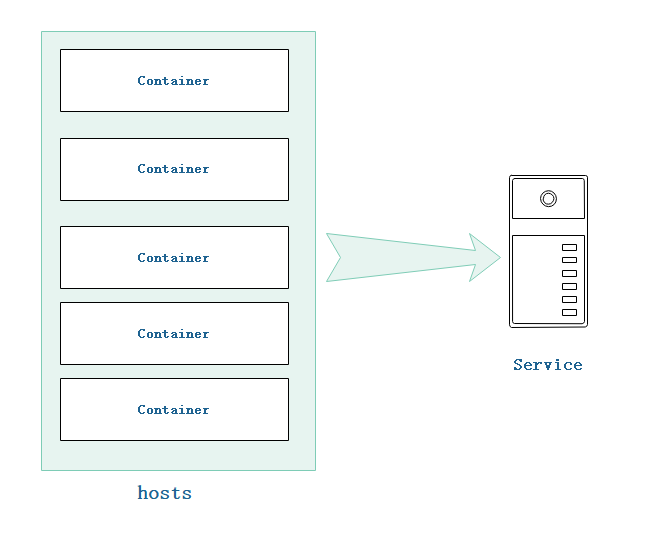
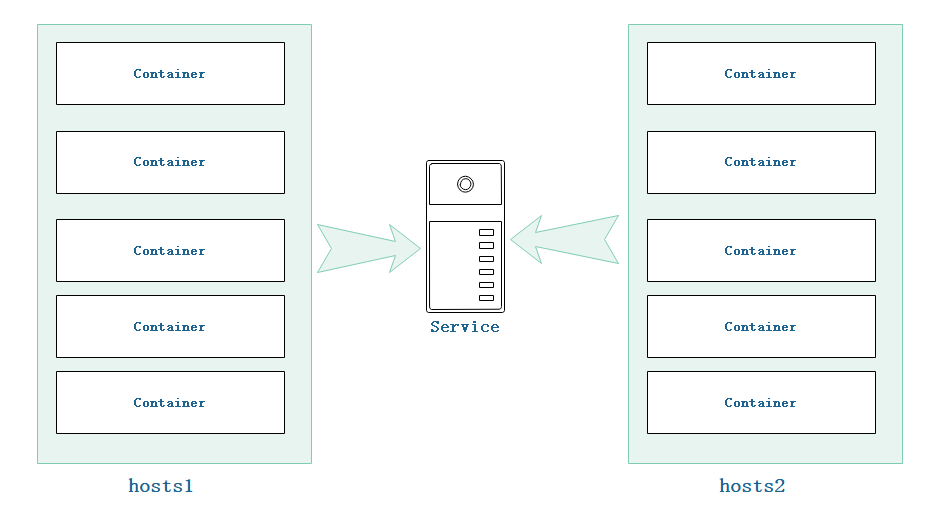

# 什么是集群

群（`swarm`）是运行 Docker 并加入集群的 **一组机器**。集群中的机器可以是物理的，也可以是虚拟的。加入群体后的机器，称为 **节点** 。
群管理器（`Swarm managers`）可以使用几种策略来运行容器，例如 **空节点** —— 用容器填充利用率最低的机器。或 **全局**，它确保每台机器恰好获得指定容器的一个实例。
搭建群集群也是使用 `docker-compose.yml` 文件，就像之前运行服务一样。

**群管理器** 是群中 **唯一** 可以执行命令或授权其他机器作为工作节点加入群的机器。工作节点只是在那里提供生产能力，而没有权力告诉任何其他机器它能做什么和不能做什么。
在之前运行服务时在一台主机中运行了一个镜像的多个实例，可以称这为单机群或者直接成为 **集群（`swarm`）**。不过，Docker 可以切换到 **群集群模式（`swarm clusters`）**， 
即可以在多台机器上搭建同一服务，可以称这为 **群集群**。启用群集群模式可以立即使当前机器成为群管理器或群中的一个工作节点。之后，Docker 将在您管理节点上运行您执行的命令，而不仅仅是在当前机器上。

下面用两张图理解下 **集群** 与 **群集群**

<!--sec data-title="集群" data-id="section0" data-show=true ces-->


**集群：** 在单机器运行一个镜像的多个实例。
<!--endsec-->

<!--sec data-title="群集群" data-id="section1" data-show=true ces-->


**群集群：** 在多机器上运行一个镜像的多个实例，并且每个节点又可以运行同一镜像的多个实例
<!--endsec-->


# 几个重要概念

### Swarm

Docker Engline 中集成的集群管理和编排功能都是基于 **SwarmKit** 实现。参与到集群中的 Docker Engine 会进入 swarm 模式。比如初始化一个 swarm 或加入已有的 swarm。

一个 **swarm** 就是个一个 Docker Engine 集群，你可以在上面部署 **服务**。Docker Engine CLI 提供了用于 swarm 管理的命令，比如添加或移除一个节点。同样还提供了用于部署服务到 swarm 和管理服务编排的命令。

当 Docker Engine 运行在 swarm 模式时，你管理容器。当 Docker Engine 运行在 swarm 模式时，你编排服务。

### 节点

每个参与到 `swarm` 中的 `Docker Engin`e 都称之为一个节点。

将服务的定义提交到 **管理节点** 即可将应用部署到 `swarm`。然后管理节点将叫作 **任务** 的工作单元分发到工作节点。

为了维持 `swarm` 的目标状态，管理节点还将承当编排和集群管理的功能。一般有多个管理节点，它们之间会选出一个领导来进行编排任务。

**工作节点** 接收并执行来自管理节点分发的任务。默认情况下，管理节点也是工作节点，你可以把它配置成只当管理节点。代理通知管理节点已分配任务的当前状态，以便管理节点维护所需的状态。

### 服务和任务

服务定义了需要在工作节点上执行的任务。它是 `swarm` 系统的中心结构，也是用户和 `swarm` 交互的主要根源。

服务包括要使用的容器镜像，以及在容器中执行的指令。

对于 **复制服务**，管理节点根据服务的规模和目标状态将一定数量的任务副本分发到各节点上。

对于 **全局服务**，每个节点上都将分发一个任务副本。

**任务** 包含一个容器和需要在容器中执行的指令。它是 swarm 原子调度单位。管理节点根据服务规模中定义的副本数量将任务分配给工作节点。一旦某个任务被分配到某个节点，就不能再移动到其他节点。它只能在分配的节点上运行或者失败。

### 负载均衡

`swarm` 管理节点使用 入口 **负载均衡** 的方式暴露你想要让外部访问的服务。`Swarm` 管理节点可以自动将一个服务分配到某个 发布端口，或者你可以为服务指定一个 **发布端口**。你可以指定任意未使用的端口。如果你没指定端口，`swarm` 管理节点将为服务指定一个 `30000-32757` 之间的端口。

外部组件，比如云负载均衡器，可以通过集群中的任意节点访问发布端口上的服务，不管当前节点上是否有服务对应的任务在运行，`swarm` 中的所有节点都会将进入连接路由到正在运行任务的实例上。

`Swarm` 模式有一个内置的 `DNS` 组件，它会自动给 `swarm` 中的每个服务分配一个 `DNS` 条目。`Swarm` 管理器使用 `internal load balancing` 基于服务对应的 `DNS` 名称在服务之间分发请求。

# 管理节点与工作节点

在 Docker 中，启用群模式使用 `docker swarm init` 命令和 `docker swarm join --token <swarm_manager_token>` 命令。

```
$ docker swarm init
```

该命令是将该机器初始化为群的一个节点，并且为群管理节点。

```
$ docker swarm join --token <swarm_manager_token>
```

该命令是将当前机器加入群中，并且该机器只能作为群的工作节点，并非管理节点。

---

**管理节点与工作节点的区别**

管理节点是管理集群的所有节点以及命令，而工作节点不能使用命令去修改或管理节点。

在 Docker 中，开启集群模式可以在多台机器之上，也可以在虚拟机上。另外，docker 本身有提供 `docker-machine` 来进行管理节点。这其实就是一个虚拟机。

下面就详细说下在多台机器上搭建集群以及使用 `docker-machine` 在一台机器中使用虚拟机搭建集群。
