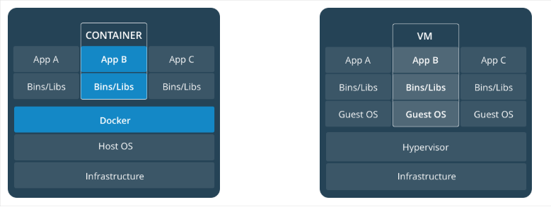

# 容器化的优势

<!--sec data-title="隔离强" data-id="section0" data-show=true ces-->
**过去:** 
曾记得12年那会，部门要上一个项目。那会，我是这么干的。直接去线上服务器，拷贝一个tomcat，然后改端口号，然后部署应用到webapps文件夹下，重启就好。而且我可以摸着良心说，现在还有很多传统企业是这么做的。
那么这么做的缺点？

很明显，应用之间相互影响。一个应用出现问题，CPU100%了，这个服务器上的其他应用一起凉凉。一个大型应用拆分为几十个微服务，分别交由不同的团队开发，不同团队之间水平参差不齐。如果还采用这种部署方式，你的应用和某个坑爹团队的应用部署在了同一台服务器上，至于结果，我相信你懂的。

**现在:** 
用上了docker容器后，将Docker可以将我们的应用程序打包封装到一个容器中，该容器包含了应用程序的代码、运行环境、依赖库、配置文件等必需的资源。容器之间达到进程级别的隔离，在容器中的操作，不会影响道宿主机和其他容器，这样就不会出现应用之间相互影响的情形！
<!--endsec-->

<!--sec data-title="可移植性" data-id="section1" data-show=true ces-->
**过去:** 
曾几何时我们和测试MM之间聊天内容是这样的

>开发:"你去测试环境上，按照开发环境一样，再去搭三套一样的测试环境！"    

>测试:"我….."    

>几个小时过去了…    

>测试:"你帮我看看，为什么启动报错，是不是漏配了什么参数?"    

>开发:"我…."

于是接下来几个小时就这么愉快的和测试mm一起聊天中过去了！！嗯，我相信有些公司是为了解决开发的单身问题，才不使用docker,用心良苦!

然而，和运维GG之间聊天一般是这样的

>运维:"开发这群脑残，发布的新war包，又把生产搞挂了！"   

>开发:"这帮运维傻叉么，我本地好好的，怎么一上生产就不行了！"   

…

于是接下来的几个小时，就在和运维之间的撕逼中过去了!嗯，最终苦的是用户啊！

**现在:** 
自从用上docker容器后，可以实现开发、测试和生产环境的统一化和标准化。镜像作为标准的交付件，可在开发、测试和生产环境上以容器来运行，最终实现三套环境上的应用以及运行所依赖内容的完全一致。
在现在微服务的架构中，一个应用拆成几十个微服务，每个微服务都对应有开发、测试、生产三套环境需要搭建。自己算算，如果采用传统的部署方式，有多少环境需要部署。曾听闻某公司在新建一个项目的时候，要花整整一个礼拜来搭建环境，简直是惨不忍睹!

**什么，你和我说，你们用上了docker，却还存在这些问题？**

笔者曾见过某些公司是这么用docker的。确实虚拟化出容器了，然后在容器上建立ssh server。接下来就厉害了，部署方式完全没变，直接连上容器，一切部署照旧！对此，我也是一言难尽啊！你们这是给领导搭的docker么？
<!--endsec-->

<!--sec data-title="轻量和高效" data-id="section2" data-show=true ces-->
**过去:** 
在2016年的时候，那会在另一家大厂工作。这家稍微规范一点了，一个应用部署在一个虚拟机上！当时最大的体会就是一个，虚拟机非常重，构建速度慢，且占用资源多，一台物理机上只能起十来个虚拟机！

**现在:**
和虚拟机相比，容器仅需要封装应用和应用需要的依赖文件，实现轻量的应用运行环境，且拥有比虚拟机更高的硬件资源利用率。在微服务架构中，有些服务负载压力大，需要以集群部署，可能要部署几十台机器上，对于某些中小型公司来说，使用虚拟机，代价太大。如果用容器，同样的物理机则能支持上千个容器，对中小型公司来说，省钱！

笔者注：笔者一直觉得这个特性只是一个障眼法。
比如，你说容器启动速度快？难道你工作中吃饱了撑着没事干，一直重启虚拟机么？
你说虚拟机消耗资源多？绝大部分公司的服务器资源利用率应该都不到 50%，大量的CPU、内存、本地磁盘都是常年浪费的，所以 VM 的额外开销不过是浪费了原本就在浪费的资源罢了。所以笔者认为，对于传统应用来说，使用和不使用Docker可能并不能直接给企业带来好处，相反使用中遇到了问题肯定会给企业带来麻烦，对于传统企业来说，不要盲目跟风，VM虚拟机其实够用了！。

- 以上来源 [程序员小灰](https://mp.weixin.qq.com/s?__biz=MzIxMjE5MTE1Nw==&mid=2653196290&idx=2&sn=b9dab5923f77dd7533789f7c3950dafb&chksm=8c99e2d8bbee6bcebe7a363e97e70884eb5a28a9aa90679e4f14c98d7923c63bf11f6a91a846&mpshare=1&scene=1&srcid=#rd)
- <!--endsec-->

# Docker VS VM

先看下 Docker 容器与 VM 架构图：

从上图可知 Docker 没有传统虚拟化中的 `Hypervisor` 层。因此，docker 是基于容器技术的轻量级虚拟化，相对于传统虚拟化技术省去了 `Hypervisor` 层的开销，而且其虚拟化技术是基于内核的 Cgroup 和 Namespace 技术，处理逻辑与内湖深度融合，所以在很多方面，它的性能与物理机非常接近，这是虚拟机远远不能够比拟的。

在通信上，docker 并不会直接与内核交互，他是通过一个更底层的工具 Libcontaoner 与内核交互的。

虚拟机是用来进行硬件资源划分的完美解决方案，它利用了硬件虚拟化技术来实现对资源的彻底分离；而容器则是操作系统级别的虚拟化，利用的是内核 Cgroup 和 Namespace 特性，此功能完全通过软件来实现，仅仅是进程本身就可以与其他进程隔离，不需要任何辅助。

Docker 容器与主机共享操作系统内核，不同的容器之间可以共享部分系统资源。因此，容器更轻量级，消耗的资源也更少。

而虚拟机会独占分配给自己的资源，几乎不存在资源共享。各虚拟机实例之间近乎完全隔离，所以虚拟机更加重量级，也会消耗更多的资源。

我们可以很轻松的在一台普通的 Linux 机器上运行 100 或更多的 Docker 容器，而且不会占用太多系统资源；而在单台几区上不可能创建 100 台虚拟机。

另外，docker 容器启动很快，通常是秒级甚至是毫秒级启动。而虚拟机的启动虽然快于物理机器，但是启动时间也是在数秒至数十秒的量级。

下面看下 VM 与 Docker 对比：

|   特性     |   容器    |   虚拟机   |
| :--------   | :--------  | :---------- |
| 启动       | 秒级      | 分钟级     |
| 硬盘使用   | 一般为 `MB` | 一般为 `GB`  |
| 性能       | 接近原生  | 弱于       |
| 系统支持量 | 单机支持上千个容器 | 一般几十个 |

# 为什么要使用 Docker？

现在再来总结下为什么要使用 Docker。作为一种新兴的虚拟化方式，Docker 跟传统的虚拟化方式相比具有众多的优势。

<!--sec data-title="更高效的利用系统资源" data-id="section3" data-show=true ces-->
由于容器不需要进行硬件虚拟以及运行完整操作系统等额外开销，Docker 对系统资源的利用率更高。无论是应用执行速度、内存损耗或者文件存储速度，都要比传统虚拟机技术更高效。因此，相比虚拟机技术，一个相同配置的主机，往往可以运行更多数量的应用。
<!--endsec-->

<!--sec data-title="更快速的启动时间" data-id="section4" data-show=true ces-->
传统的虚拟机技术启动应用服务往往需要数分钟，而 Docker 容器应用，由于直接运行于宿主内核，无需启动完整的操作系统，因此可以做到秒级、甚至毫秒级的启动时间。大大的节约了开发、测试、部署的时间。
<!--endsec-->

<!--sec data-title="一致的运行环境" data-id="section5" data-show=true ces-->
开发过程中一个常见的问题是环境一致性问题。由于开发环境、测试环境、生产环境不一致，导致有些 bug 并未在开发过程中被发现。而 Docker 的镜像提供了除内核外完整的运行时环境，确保了应用运行环境一致性，从而不会再出现 *「这段代码在我机器上没问题啊」* 这类问题。
<!--endsec-->

<!--sec data-title="持续交付和部署" data-id="section6" data-show=true ces-->
对开发和运维（[DevOps](https://zh.wikipedia.org/wiki/DevOps)）人员来说，最希望的就是一次创建或配置，可以在任意地方正常运行。

使用 Docker 可以通过定制应用镜像来实现持续集成、持续交付、部署。开发人员可以通过 [Dockerfile](../image/dockerfile/) 来进行镜像构建，并结合 [持续集成(Continuous Integration)](https://en.wikipedia.org/wiki/Continuous_integration) 系统进行集成测试，而运维人员则可以直接在生产环境中快速部署该镜像，甚至结合 [持续部署(Continuous Delivery/Deployment)](https://en.wikipedia.org/wiki/Continuous_delivery) 系统进行自动部署。

而且使用 `Dockerfile` 使镜像构建透明化，不仅仅开发团队可以理解应用运行环境，也方便运维团队理解应用运行所需条件，帮助更好的生产环境中部署该镜像。
<!--endsec-->

<!--sec data-title="更轻松的迁移" data-id="section7" data-show=true ces-->
由于 Docker 确保了执行环境的一致性，使得应用的迁移更加容易。Docker 可以在很多平台上运行，无论是物理机、虚拟机、公有云、私有云，甚至是笔记本，其运行结果是一致的。因此用户可以很轻易的将在一个平台上运行的应用，迁移到另一个平台上，而不用担心运行环境的变化导致应用无法正常运行的情况。
<!--endsec-->

<!--sec data-title="更轻松的维护和扩展" data-id="section8" data-show=true ces-->
Docker 使用的分层存储以及镜像的技术，使得应用重复部分的复用更为容易，也使得应用的维护更新更加简单，基于基础镜像进一步扩展镜像也变得非常简单。此外，Docker 团队同各个开源项目团队一起维护了一大批高质量的 [官方镜像](https://store.docker.com/search?q=&source=verified&type=image)，既可以直接在生产环境使用，又可以作为基础进一步定制，大大的降低了应用服务的镜像制作成本。
<!--endsec-->