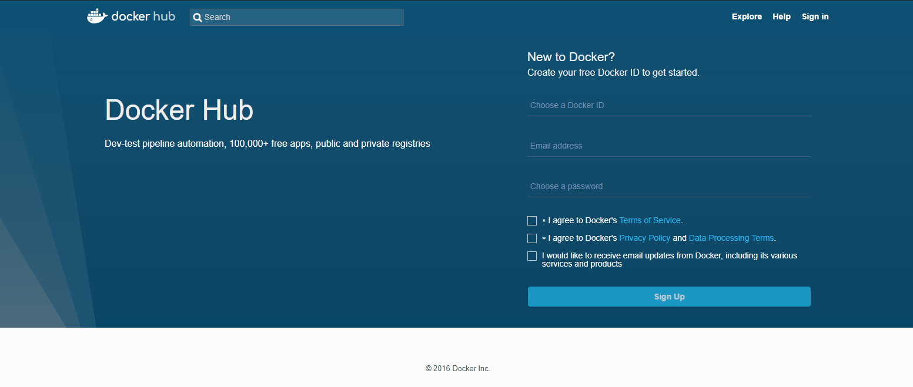
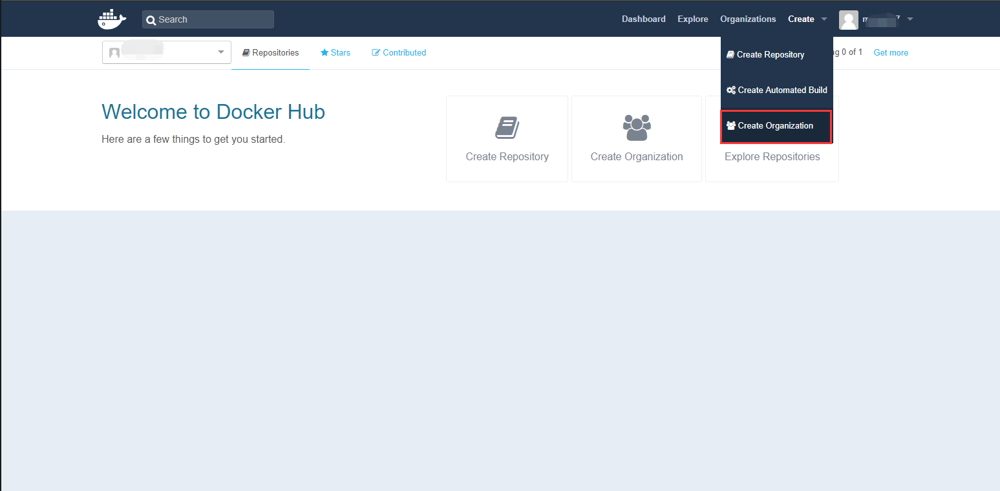

# Docker Hub

[Docker Hub](https://hub.docker.com/) 是 Docker 官方镜像库，Docker Hub 与 GitHub 相同。区别在于 GitHub 是用于托管代码，而 Docker Hub 是用来托管镜像。在使用 Docker 之前建议先去官网注册一个 Docker Hub 账号：



注册完成后就可以创建一个属于自己的组织，这样就可以将自己的镜像推送至这个组织中方便管理：



当前 Duchker Hub 托管镜像近 150000 个，如 Centos、Nginx、Redis、MySQL、Mongo、Jenkins等优秀镜像。我们可以直径进行在官网进行搜索自己想要的镜像。比如笔者想要 openJdk 镜像：


可以看到超过 3500 个托管镜像，包括个人的与官方的。当我们创建一个 Docker Hub 账号后我们就能将自己的镜像托管至仓库，可以让别人使用自己构建的镜像。

点击其中一个镜像就能看到该镜像的详情数据，包括版本信息与基本介绍等。


可以看到在右侧有一个 Docker Pull Command 命令，如果想获取该镜像在命令行中输入该命令即可。当然，搜索镜像不乏只有这一个途径。

我们也可以直接在命令行中搜索镜像：

```
$ docker search <image_name>
```

命令示例：

```
$ docker search openjdk

NAME                               DESCRIPTION                                     STARS               OFFICIAL            AUTOMATED
openjdk                            OpenJDK is an open-source implementation of …   1405                [OK]                
azul/zulu-openjdk                  Zulu is a fully tested, compatibility verifi…   97                                      [OK]
oracle/openjdk                     Docker images containing OpenJDK Oracle Linux   52                                      [OK]
fabric8/java-jboss-openjdk8-jdk    Fabric8 Java Base Image (JBoss, OpenJDK 8)      24                                      [OK]
azul/zulu-openjdk-debian           Zulu is a fully tested, compatibility verifi…   20                                      [OK]
adoptopenjdk/openjdk11             Docker Images for OpenJDK Version 11 binarie…   16                                      
fabric8/java-alpine-openjdk8-jdk   Fabric8 Java Base Image (Alpine, OpenJDK 8, …   16                                      [OK]
adoptopenjdk/openjdk8              Docker Images for OpenJDK Version 8 binaries…   15                                      
picoded/ubuntu-openjdk-8-jdk       Ubuntu 16.04 LTS, with openjdk-8-jdk install…   12                                      [OK]
shipilev/openjdk                   Experimental OpenJDK development builds         9                                       
arm32v7/openjdk                    OpenJDK is an open-source implementation of …   6                                       
azul/zulu-openjdk-centos           Zulu is a fully tested, compatibility verifi…   5                                       [OK]
adoptopenjdk/openjdk10             Docker Images for OpenJDK Version 10 binarie…   4                                       
adoptopenjdk/openjdk9              Docker Images for OpenJDK Version 9 binaries…   2                                       
resin/qemux86-64-openjdk           OpenJDK is an open-source implementation of …   1                                       
circleci/openjdk                   CircleCI images for OpenJDK                     1                                       [OK]
i386/openjdk                       OpenJDK is an open-source implementation of …   1                                       
opennms/openjdk                    Base image providing OpenJDK for OpenNMS ser…   1                                       [OK]
resin/qemux86-alpine-openjdk       OpenJDK is an open-source implementation of …   0                                       
trollin/openjdk                                                                    0                                       
amd64/openjdk                      OpenJDK is an open-source implementation of …   0                                       
classmethod/openjdk-with-git       docker image for openjdk and git                0                                       [OK]
ccistaging/openjdk                 CircleCI images for OpenJDK                     0                                       [OK]
cfje/openjdk                       OpenJDK Builder Image                           0                                       
vicamo/openjdk                     Docker images for openjdk                       0                                       [OK]
```

如果想要拉去想要的镜像使用如下命令即可：

```
$ docker search <image_name[:tag]>
```

命令示例：

```
$ docker images ls
REPOSITORY             TAG                 IMAGE ID            CREATED             SIZE
ifkeeper/centos-jvm8   v1.0.0              e15334134272        15 hours ago        583MB
centos                 latest              1e1148e4cc2c        3 days ago          202MB

$ docker pull openjdk

Using default tag: latest
latest: Pulling from library/openjdk
16e82e17faef: Pull complete 
117dc02416a3: Pull complete 
7e4c717259ac: Pull complete 
7a518b8f48be: Pull complete 
add32d44f708: Pull complete 
a0158fa08543: Pull complete 
eacd9302ecfd: Pull complete 
8f9d52bf6cde: Pull complete 
Digest: sha256:2cbb95c7479634c53bc2be243554a98d6928c189360fa958d2c970974e7f131f
Status: Downloaded newer image for openjdk:latest

$ docker images ls
REPOSITORY             TAG                 IMAGE ID            CREATED             SIZE
ifkeeper/centos-jvm8   v1.0.0              e15334134272        15 hours ago        583MB
centos                 latest              1e1148e4cc2c        3 days ago          202MB
openjdk                latest              8e7eacedab93        4 days ago          986MB
```

可以看到成功将 openjdk 镜像拉去下来，并且版本为 `latest`。现在我们就可以基于该镜像构建属于自己的镜像了！
