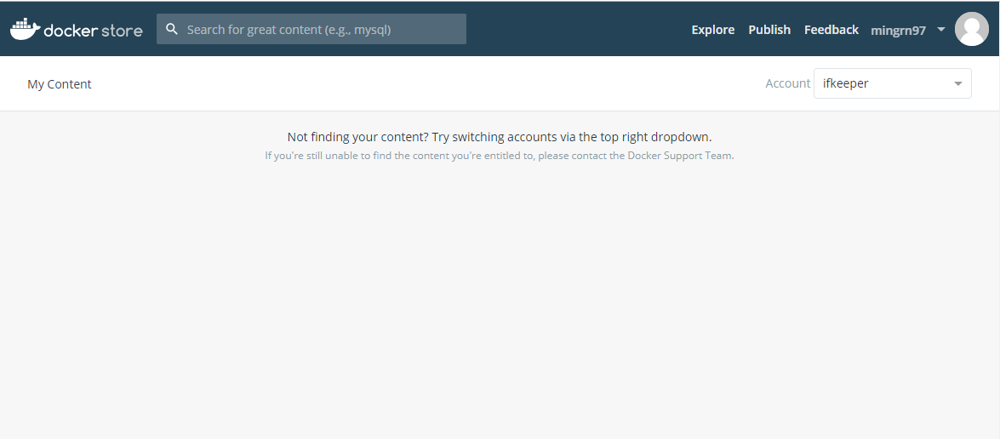
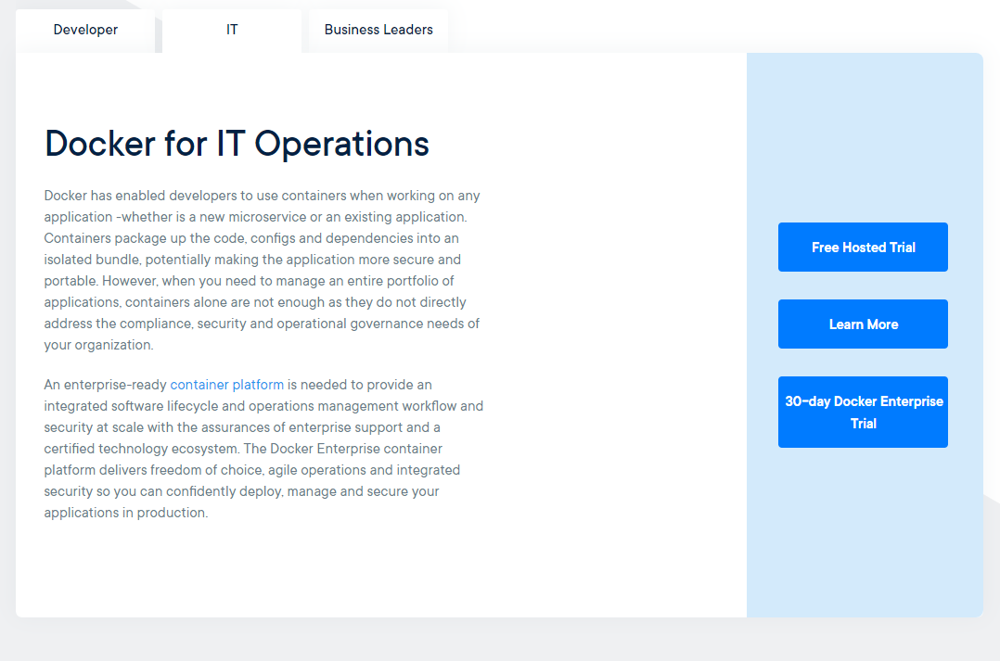
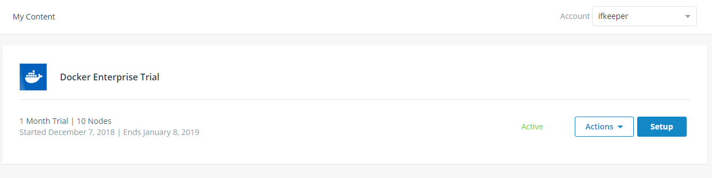

# OS 条件

Docker EE 仅支持 64位 Centos7 或更高版本，运行在 `x86_64` 之上。

在 Centos 上，Docker 支持 `overlay2` 和 `devicemapper` 存储驱动。在 Docker EE `v17.06.2-ee5` 和更高的版中 `overlay2` 是推荐的存储驱动。

# 获取 Docker EE Repo URL

Docker EE （企业版）是需要付费的专业版本。因为是需要付费版本在安全上肯定要比 CE 版本出色。同样的，想要在 Centos 中安装 Docekr EE 版本首先第一步就需要获取你的仓库 URL （`Docekr EE Repo URL`）：

- 进入 [My Content](https://store.docker.com/my-content) 页面，首先需要登录。找到你设置的其中一个组织获取仓库 URL。比如，笔者这里登录后进入 `ifkeeper` 组织。如果进入组织后提示 `Not finding your content` 原因是你还没有获取专业版，如下所示：



如果看到这个页面的提示你需要获取专业版，如果你不想花钱，可喜的是。Docker 官网有提供免费 30 天试用专业版选择方案。

进入 [**Docker 官网**](https://www.docker.com)

在该页面再点击 [**30 day Docker Enterprose Trial**](https://store.docker.com/editions/enterprise/docker-ee-trial) 会进入 Docker Store 页面。



在 Docker Store 页面点击 [**Start 1 Month Trial**](https://store.docker.com/editions/enterprise/docker-ee-trial/trial)，然后会进入企业信息填写面板。


在信息面板提交后可返回自己的 [**Content**](https://store.docker.com/my-content) 面板，选择你在信息面板提交的组织，就能看到你的仓库信息。



然后点击 **Setup** 进入仓库信息面板。

在右侧就能看到当前组织的仓库URL（`repo url`）。


现在，已经有了存储仓库，就可以继续以下步骤了！

# 卸载 Old Version

Docker EE 包命名为 `docker-ee`。老版本被命名为 `docekr` 或者 `docker-engine`，在安装之前需要卸载老版本。另外，docker 数据被存储在 `/var/lib/docker` 文件夹下。包括镜像（`images`）、容器（`containers`）、卷（`volumes`）、网络（`networks`）等数据。如果你是从 `Docker CE` 升级到 `Docker EE`，最好将这些数据进行删除。执行如下命令进行删除：

```
$ sudo rm -rf /var/lib/docker
```

现在开始卸载老版本，执行如下命令：

```
$ sudo yum remove docker \
                  docker-client \
                  docker-client-latest \
                  docker-common \
                  docker-latest \
                  docker-latest-logrotate \
                  docker-logrotate \
                  docker-selinux \
                  docker-engine-selinux \
                  docker-engine \
                  docker-ce
```

命令执行示例：

```
$ sudo yum remove docker \
>                 docker-client \
>                 docker-client-latest \
>                 docker-common \
>                 docker-latest \
>                 docker-latest-logrotate \
>                 docker-logrotate \
>                 docker-selinux \
>                 docker-engine-selinux \
>                 docker-engine \
>                 docker-ce

......
正在解决依赖关系
--> 正在检查事务
---> 软件包 container-selinux.noarch.2.2.74-1.el7 将被 删除
---> 软件包 docker-ce.x86_64.3.18.09.0-3.el7 将被 删除
--> 解决依赖关系完成

依赖关系解决

=====================================================================================================================================
 Package                           架构                   版本                               源                                 大小
=====================================================================================================================================
正在删除:
 container-selinux                 noarch                 2:2.74-1.el7                       @extras                            37 k
 docker-ce                         x86_64                 3:18.09.0-3.el7                    @docker-ce-stable                  81 M

事务概要
=====================================================================================================================================
移除  2 软件包

安装大小：81 M
Downloading packages:
Running transaction check
Running transaction test
Transaction test succeeded
Running transaction
未将 /usr/bin/dockerd 配置为 dockerd 的备用项
  正在删除    : 3:docker-ce-18.09.0-3.el7.x86_64                                                                                                                                         1/2 
  正在删除    : 2:container-selinux-2.74-1.el7.noarch                                                                                                                                    2/2 
  验证中      : 2:container-selinux-2.74-1.el7.noarch                                                                                                                                    1/2 
  验证中      : 3:docker-ce-18.09.0-3.el7.x86_64                                                                                                                                         2/2 

删除:
  container-selinux.noarch 2:2.74-1.el7                                                           docker-ce.x86_64 3:18.09.0-3.el7                                                          

完毕！
```

# 设置 Docker Repository

首次在新的主机上安装 Docker EE 之前，您需要设置 Docker EE 镜像仓库。然后，您可以从此镜像仓库安装和更新 Docker EE。

Docker 存储库位于 `/etc/yum.repos.d`。如果之前已经设置过需要进行删除，执行如下命令进行删除：

```
$ sudo rm /etc/yum.repos.d/docker*.repo
```

然后将你的 Docker EE 镜像仓库 URL（`Docker EE Repo URL`）设置到环境变量中。在 [获取 Docker EE Repo URL](#获取 Docker EE Repo URL) 中已经获取到了你的仓库 URL。在 `/ect/profile` 文件中设置，将下面命令中的 `<DOCKER-EE-URL>` 设置为你的 `Repo URL`：

```
$ export DOCKERURL="<DOCKER-EE-URL>"
```

然后直接应用环境变量：

```
$ source /etc/profile
```

然后再执行如下命令在 `/etc/yum/vars/` 的 `yum` 变量中存储您的 Docker EE 镜像仓库 URL：

```
$ sudo -E sh -c 'echo "$DOCKER_URL/centos" > /etc/yum/vars/dockerurl'
```

然后就能在 `yum` 环境变量中看到你的 Repo Url：

```
$ vim /etc/yum/vars/dockerurl
```

现在需要安装所需的软件包，`yum-utils` 提供了 `yum-config-manager` 实用程序，并且 `devicemapper` 存储驱动需要 `device-mapper-persistent-data` 和 `lvm2`。

执行如下命令进行安装：

```
$ sudo yum install -y yum-utils device-mapper-persistent-data lvm2
```

命令执行示例：

```
$ sudo yum install -y yum-utils device-mapper-persistent-data lvm2

......                                                                                                                                                               | 3.4 kB  00:00:00     
http://centos.ustc.edu.cn/centos/7.6.1810/updates/x86_64/repodata/repomd.xml: [Errno 12] Timeout on http://centos.ustc.edu.cn/centos/7.6.1810/updates/x86_64/repodata/repomd.xml: (28, 'Operation too slow. Less than 1000 bytes/sec transferred the last 30 seconds')
正在尝试其它镜像。
updates                                                                                                                                                               | 3.4 kB  00:00:00     
(1/2): extras/7/x86_64/primary_db                                                                                                                                     | 154 kB  00:00:00     
updates/7/x86_64/primary_db    FAILED                                           22% [================                                                      ]   27 B/s | 343 kB  12:02:50 ETA 
http://mirrors.nju.edu.cn/centos/7.6.1810/updates/x86_64/repodata/16c70c9474a229ad4444c53c2c299a968e8d822fad19c39beb0de669aff05d44-primary.sqlite.bz2: [Errno 12] Timeout on http://mirrors.nju.edu.cn/centos/7.6.1810/updates/x86_64/repodata/16c70c9474a229ad4444c53c2c299a968e8d822fad19c39beb0de669aff05d44-primary.sqlite.bz2: (28, 'Operation too slow. Less than 1000 bytes/sec transferred the last 30 seconds')
正在尝试其它镜像。
(2/2): updates/7/x86_64/primary_db                                                                                                                                    | 1.3 MB  00:00:01     
软件包 yum-utils-1.1.31-50.el7.noarch 已安装并且是最新版本
软件包 device-mapper-persistent-data-0.7.3-3.el7.x86_64 已安装并且是最新版本
软件包 7:lvm2-2.02.180-10.el7_6.2.x86_64 已安装并且是最新版本
......
```

接着再使用如下命令添加 `stable` 版镜像仓库：

```
$ sudo -E yum-config-manager \ 
       --add-repo \ 
       "$DOCKER_URL/centos/docker-ee.repo"
```

命令执行示例：

```
$ sudo -E yum-config-manager --add-repo "$DOCKER_URL/centos/docker-ee.repo"

adding repo from: https://storebits.docker.com/ee/trial/sub-d09f95f2-e8a6-4358-820c-**********/centos/docker-ee.repo
grabbing file https://storebits.docker.com/ee/trial/sub-d09f95f2-e8a6-4358-820c-**********/centos/docker-ee.repo to /etc/yum.repos.d/docker-ee.repo
Could not fetch/save url https://storebits.docker.com/ee/trial/sub-d09f95f2-e8a6-4358-820c-**********/centos/docker-ee.repo to file /etc/yum.repos.d/docker-ee.repo: [Errno 14] HTTPS Error 403 - Forbidden
```

如果你看到如上错误原据说是在国内访问不到 docker 官方镜像的缘故，试试梯子。

# 开始安装 Docker EE

更新 yum 软件包索引。

```
$ sudo yum makecache fast
```

**安装最新版本：**

```
$ sudo yum -y install docker-ee
```

这种方式总是安装最新版本，如果想安装指定版本使用下面安装方式：

**安装指定版本：**

安装指定版本首先需要查找版本列表，指定其中一个进行安装。使用下面命令进行查找版本列表：

```
$ sudo yum list docker-ee  --showduplicates | sort -r

docker-ee.x86_64      2.1.ee.2-1.el7.centos      docker-ee-stable-18.09
```

此列表的内容取决于启用了哪些镜像仓库，并且将特定于您的 CentOS 版本（在本示例中，由版本中的 .el7 后缀表示）。选择一个特定版本进行安装。第二列为版本字符串。第三列为镜像仓库名称，它表示软件包来自哪个镜像仓库并按扩展其稳定性级别列出。如需安装特定版本，请将版本字符串附加到软件包名称，并使用连字符 (-) 分隔它们：

```
$ sudo yum install -y docker-ee-<VERSION>
```

编辑 `/etc/docker/daemon.json`。如果不存在该文件，需要进行创建。如果文件已存在，将下面内容添加进去：

```json
{
    "storage-driver": "devicemapper"
}
```

对于生产系统，必须使用 **direct-lvm** 模式，此模式要求您准备块设备。先按照 [devicemapper](https://docs.docker-cn.com/engine/userguide/storagedriver/device-mapper-driver/#configure-direct-lvm-mode-for-production) 存储驱动指南 中的过程执行操作，然后再启动 Docker。请不要跳过此步骤。

# 运行 Docker EE

```
$ sudo systemctl start docker
```

可以输入命令如下命令查看 docker 进程：

```
$ ps -aux | grep docker
```

# 验证 Docker

验证是否正确安装了 `Docker EE`，方法是运行 `hello-world` 镜像。

```
$ sudo docker run hello-world
```

此命令将下载一个测试镜像并在容器中运行它。容器运行时，它将输出一条参考消息并退出。

现在 Docker 才算真正的安装运行完成。运行 docker 需要使用 sudo 超级管理员身份运行。可以点击 [**传送门**](https://docs.docker.com/install/linux/linux-postinstall/) 进行设置允许非特权用户进行运行 Docker 命令。

# 更新 Docker EE

要升级 Docker EE，首先运行 `sudo yum makecache fast`，然后按照 [开始安装 Docker E](#开始安装 Docker E) 执行操作，并选择您要安装的新版本。

# 卸载 Docker EE

卸载 Docker EE 软件包：

```
$ sudo yum remove docker-ee
```

主机上的镜像、容器、存储卷、或定制配置文件不会自动删除。如需删除所有镜像、容器和存储卷，请运行下列命令：

```
$ sudo rm -rf /var/lib/docker
```

需要时，删除 `devicemapper` 精简池并重新格式化其包含的块设备。

你必须手动删除任何已编辑的配置文件


