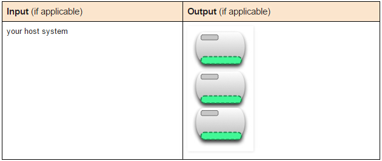
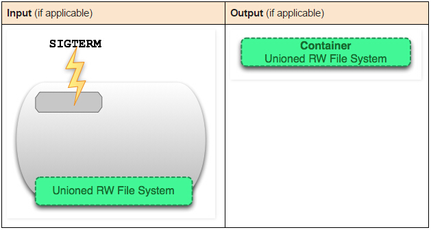
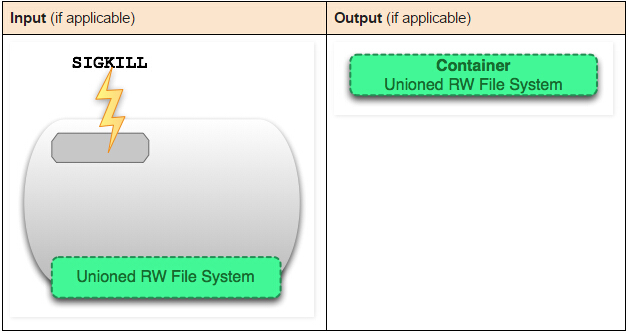
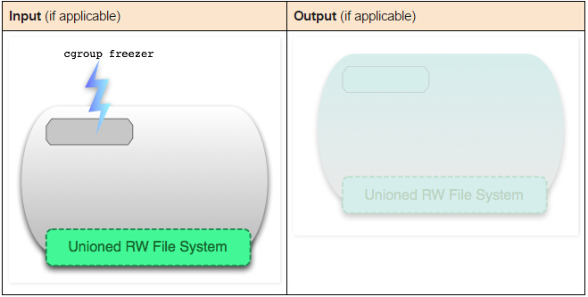
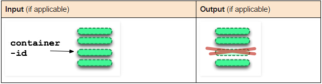
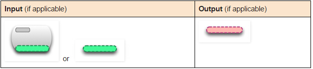
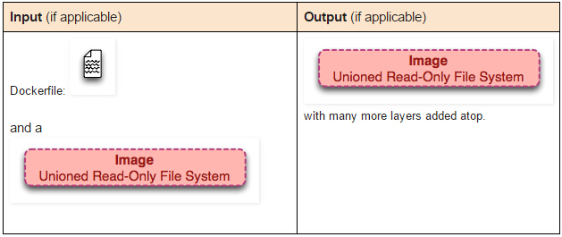
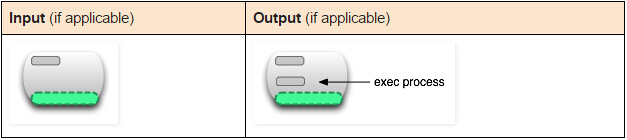
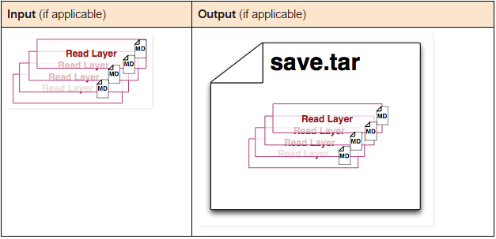
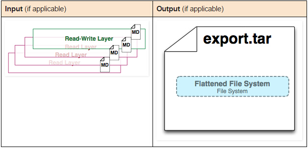

# 图解 Docker 容器和镜像

本章主要是深入理解 Docker 的命令（`command`）、容器（`container`）、镜像（`image`） 之间的区别。并深入探讨容器和运行中的容器之间的区别。


当对 Docker 技术一知半解的时候，我发现理解 Docker 命令灰常的困难。不过，当你花点时间来学习 Docker 的工作原理，更确切的说，是关于 Docker 统一文件系统（the union file system）的知识。然后回头再来看 Docker 的命令，一切都变得顺理成章、简单极了！

# Image 定义

镜像（`image`）就是一堆只读层（`read-only Layer`）的统一视角，也许这个定义难以理解，下面这张图能帮助理解镜像的定义：


从左边可以看到多个只读层，他们重叠在一起。除了最下面一层，其他层都会有一个指针指向下一层。这些层是 Docker 内部的实现细节，并且能够在主机（运行 Docker 的机器）的文件系统上访问到。统一文件系统（`union file system`）技术能够将不同的层整个成一个文件系统，为这些层提供一个统一的视角，这样就隐藏了多层的存在，在用户的角度来看，只存在一个文件系统。我们可以在图片右边看到这个视角的形式。

可以在自己的主机文件系统上找到有关这些层的文件。需要注意的是，在一个运行中的容器内部，这些层是不可见的。在我的主机上，我发现他们存在于 `/var/lib/docker/overlay2` 目录下。

```
sudo tree -L 1 /var/lib/docker/
/var/lib/docker/
├── builder
├── buildkit
├── containerd
├── containers
├── image
├── network
├── overlay2
├── plugins
├── runtimes
├── swarm
├── tmp
├── trust
└── volumes
```

# Container 定义

容器（`container`）的定义和镜像（`image`）几乎一模一样，也是一堆层的统一视角。唯一的区别在于最上面那一层是一个 **可读写的层**。


细心的读者可能会发现，容器的定义并没有提及容器是否在运行。没错，这是故意的。这是这个发现可以帮助理解很多困惑。

**要点**：容器（`container`）= 镜像（`image`）+ 读写层（`read-write Layer`）。并且容器的定义并没有提及是否要运行容器。

接下来，来看下运行态的容器。

# 运行态 Container 定义

一个运行态容器（`running container`）被定义为一个可读写的统一文件系统加上隔离的进程空间和包含其中的进行。看下下面这张图：


正是文件系统隔离技术使得 Docker 成为一个前途无量的技术。一个容器中的进程可能会对文件进行修改、删除、创建。这些改变都将作用于可读写层（`read-write Layer`）。下面这张图展示了这个行为：


我们可以通过运行一下命令来验证我们上面所说的：

```
$ docker run centos touch happiness.txt
```

即使这个 `centos` 容器不在运行，我们依然能够在主机的文件系统找到这个新文件：

```
[root@localhost docker]# docker ps -a
CONTAINER ID        IMAGE               COMMAND                 CREATED             STATUS                     PORTS               NAMES
a5aedb4b848e        1e1148e4cc2c        "touch happiness.txt"   7 minutes ago       Exited (0) 7 minutes ago                       awesome_chatterjee
[root@localhost docker]# find / -name happiness.txt
/var/lib/docker/overlay2/cd1fc1a...1d8cb1a2/diff/happiness.txt
```

# Image 层定义

为了将零星的数据整个起来，我们提出了镜像层（`image Layer`）这个概念。下面的这张图描述了一个镜像层。通过图片能够发现一个层并不仅仅包含文件系统的数据，它还包含其他重要的信息：


元数据（`metadata`）就是关于这个层的额外信息，它不仅能够让 Docker 获取运行和构建是的信息，它还包括父层的层次信息。需要注意的是，只读层和读写层都包含元数据。


除此之外，每一层都包含了一个指向父层的指针。如果一个层没有这个指针，说明他处于最底层。


**Metadata Location**

我发现在我自己的主机上，镜像层（`image layer`）的元数据被保存在名为 `json` 的文件中，比如说：

```
$ /var/lib/docker/graph/e809f156dc985.../json
```

`e809f156dc985...` 就是这层的id。

一个容器的元数据好像是被分成了很多文件，但或多或少能在 `/var/lib/docker/containers/<id>` 目录下找到，`<id>` 就是一个可读层的 `id`。这个目录下的文件大多是运行时的数据，比如网络、日志等等。

# 命令全局理解

现在，结合上面提到的实现细节来理解 Docker 的命令。

---
- `docker create <image-id>`


`docker create` 命令为指定的镜像（`image`） 添加了一个可读层，构成了一个新的容器。注意，这个容器没有运行！


---
- `docker start <container-id>`


`docker start` 命令为容器文件系统创建了一个进程隔离空间。注意，每一个容器只能够有一个进程隔离空间。

---
- `docker run <image-id>`


看到这个命令，可能通常会有一个疑问：`docker start` 和 `docker run` 命令有什么区别。


从图片可以看出，`docker run` 命令先是利用镜像创建了一个容器。然后运行这个容器，这个命令非常的方便，并且隐藏了两个命令的细节，但从另一方面来看，这个容易让用户误解。

**题外话：** 用过 Git 的都知道 `git pull` 命令。 `git pull` 命令就是 `git fetch` 和 `git merge` 命令的组合。同样的，`docker run` 就是 `docker create` 和 `docker start` 两个命令的组合。

---
- `docker ps`



`docker ps` 命令就会列出所有运行中的容器，这隐藏了非运行态容器的存在。如果想要找出这些容器，我们需要使用如下这个命令。

- `docker ps -a`

---


`docker ps -a` 命令会列出所有的容器，不管是运行的，还是停止的。

---
- `docker images`


`docker images` 命令会列出所有顶层（`top-level`）镜像。实际上，在这里我们没有办法区分一个镜像和一个只读镜层，所有我们提出了 top-level 镜像。只有创建容器时使用的镜像或者是直接 `pull` 下来的镜像能被称为顶层（`top-level`）镜像，并且每一个顶层镜像下面都隐藏了多个镜像层。

---
- `docker images -a`


`docker images -a` 命令列出了所有的镜像，也可以说是列出所有的可读层。如果你想要查看某一个 `image-id` 下的所有层，可以使用 `docker history` 来查看。

---
- `docjer stop <container-id>`



`docker stop` 命令会想运行中的容器发送一个 `SIGTERM` 的信号，然后停止所有的进程。

---
- `docker kill <container-id>`



`docker kill` 命令想所有运行在容器中的进程发送一个不友好的 `SIGKILL` 信号。

---
- `docker pause <container-id>`



`docker stop` 和 `docker kill` 命令会发送 `UNIX` 的信号给运行中的进程。`docker pause` 命令则不一样，它利用了 `cgroup` 的特性将运行中的进程空间暂停。但是这种方式的不足之处在于发送一个 `SIGTSTP` 信号对于进程来说不投简单易懂，以助于不能让所有进程暂停。

---
- `docekr rm <container-id>`



`docker rm` 命令会移除构成容器的可读写层。注意，这个命令只能对非运行态容器执行。

---
- `docker rmi <image-id>`


`docekr rmi` 命令会移除构成镜像的一个只读层。你只能够使用 `docker rmi` 来移除最顶层（`top level Layer`）（也可以说是镜像），你可以使用 `-f` 参数来强制删除中间的只读层。

---
- `docker commit <container-id>`



`docker commit` 命令将容器的可读层转换为一个只读层，这样就把一个容器转换成了一个不可变的镜像。


---
- `docker build`



`docker build` 命令非常有趣，它会反复的执行多个命令。


我们从上图可以看到，`build` 命令根据 `Dockerfile` 文件中的 `FROM` 指令获取到镜像，然后重读 `RUN（create 和 start）`、`update`、`commit`。在循环中每一步都会生成一个新的层，因此许多新的层会被创建。

---
- `docker exec <running-container-id>`



`docker exex` 命令会在运行中的容器执行一个新的进程。

- `docker inspect <container-id> or <image-id>`


`docker inspect` 命令会提取容器或者镜像最顶层的元数据（`metadata`）。

---
- `docker save <image-id>`



`docker save` 命令会创建一个镜像的压缩文件，这个文件能够在另外一个主机的 Docekr 上使用。和 `export` 命令不同，这个命令为每一个层都保存了他们的元数据。这个命令只能对镜像生效。

---
- `docker export <container-id>`



`docker export` 命令创建一个 `tar` 文件，并且移除了元数据和不必要的层，将多个层整个成了一个层，只保存了当前统一视角看到的内容（`export` 后的容器在 `import` 到 Docker 中，通过 `docker images -tree` 命令只能看到一个镜像，而 `save` 后的井下你给则不同，它能够看到这个镜像的历史镜像）。

---
- `docker hisory <image-id>`

`docker history` 命令递归的输出指定镜像的历史镜像。 


---

- 参考 [Docker.one](http://www.dockerone.io)
